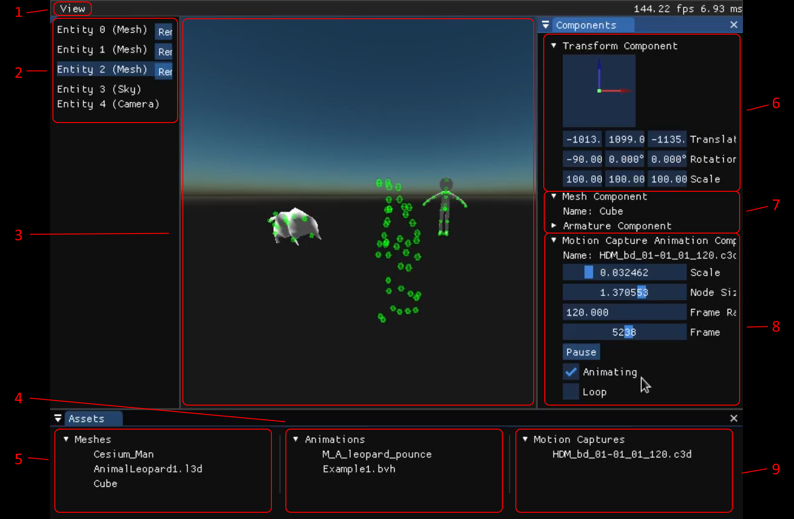
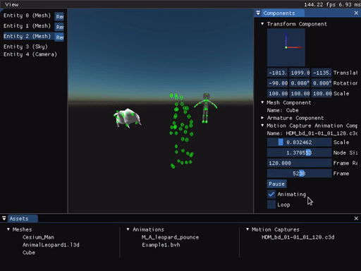
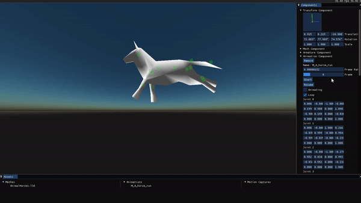

# AnimationViewer

*by Sandy Carter, Thijs Hendrickx, Amber Elferink and Anne van Ede*

## Building
Building the project requires CMake and a package manager.
There are many options for package managers.

### vcpkg

Follow the installation steps at https://github.com/Microsoft/vcpkg

Make sure to set the global environment variable `VCPKG_DEFAULT_TRIPLET=x64-windows`

Install the dependencies
```
vcpkg install --triplet x64-windows entt sdl2 glslang spirv-cross glm assimp
```

When generating the cmake project use the vcpkg toolchain file.

### msys2

Install the following packages

```bash
pacman -S mingw-w64-x86_64-sdl2 mingw-w64-x86_64-glslang mingw-w64-x86_64-spirv-cross mingw-w64-x86_64-glm  mingw-w64-x86_64-assimp
```

## The Project

To learn more about animation engines, we implemented our own. The goal was to both implement key frame animation and motion capture animation. We will discuss the program from a user perspective and explain what is behind what you see.

Because this project is meant to give us an insight in using animation and MoCap files, we chose to focus a large portion of our time on supporting multiple different file formats. It is important to work with many file formats because this gives a broader insight into using animation files as a whole. Because some file formats like FBX are closed and documentation is scarce for almost all parsers, this was a difficult task.

We support L3D, ANM, C3D, FBX, GLTF files. BVH is also partially supported, however for this the animations do not show perfectly. We implemented a skeleton structure and keyframe blending for smooth animations. We implemented skinning and a easy to use interface that allows for maximum flexibility and easy use for an animator.

[

All libraries that have been used can be found in the references.  The interface can be seen in Figure 1.

## Framework

To get the animation working, we created some data structures. Models, or Mesh Assets, have a struct per vertex in the model and a Joint struct for each joint in the model. Both have position and orientation information and the vertices have the id of the Joint they belong to. Animation assets have Frame structs with a 4 by 4 matrix of each joint in that frame. An Animation struct keeps a list of frames in addition to other information like name, frame rate and frame count of the animation. When all the above is brought together in the application we get Components that are attached to an object in the scene. These have structs like Transform, that has the current location and scale vectors and the rotation quaternions. It also has an animation, that encodes information like the current time and frame and variables like if the animation needs to be looped.


The application is created almost entirely from scratch and is created in C++ with OpenGL and GLSL shaders. It uses an Entity Component System from the EnTT library and GLSLang, GLAD and SPIR-V Cross for pre-compiling shaders. For mathematics, GLM is used.

## File types



To make this application work, we implemented several file types. We first started of with an old file format, L3D, to import models. We continued on to use ANM files for the animation with these L3D files. For both those filetypes we used an OpenBlack parser.

We also needed to be able to import motion capture data. First we used EZC3D to load C3D motion capture data. After that, we tried to use OpenFBX for FBX and BVH Loader, but after having much trouble with those libraries, we decided to use Assimp which has broad support of multiple formats including gltf. With Assimp we managed to load GLTF, FBX and BVH assets.


## Animation



The animation itself has the following features.  The animation joints can be displayed with View−>Show  Nodes  (Fig.   1:   nr.   1).   The  color  of  the  nodes  can  even  be  altered. We  implemented  skinning  for  the  animations  with  a  provided  mesh.   For  this  animation we implemented keyframe blending to generate smooth animations.

## Interface


The interface has a Unity look and feel and a clean interface.  When the application startsthere are no model or animation visible.  A panel on the left shows the entities currently inthe scene (Fig.  1:  2).  The window in the right side shows the state of the components of theselected entity (Fig.  1:  6, 7, 8).  You can change orientation, the transform, with the guizmoand view the joints (for a model) (Fig.  1:  7).  The bottom window shows all imported files in three categories:  Meshes, (keyframe) animations and motion capture animations (Fig.  1:  4, 5, 9).

Model files (l3d, fbx, gltf/glb) can be dragged in and will be visible in the bottom window and in the left window.  In addition it is added to the current scene at the projected screenspace location (Fig.  1:  3).  When animation files (anm, bvh, c3d) are dragged in, they are only visible in the bottom window.  From there they can be dragged on the models in theright window and the animation can be played.The docking windows that you see on the left, right and bottom are made with ImGui’s docking branch.  The gizmo for orientation in the top right corner is made with ImGuIZMO.SDL2 is used together with ImGui to facilitate the drag and drop function.

## What file works with what?
The L3D file works with an ANM animation.  GLB/GLTF contains both mesh and animation in  one  file.   For  this,  first  drag  in  the  mesh  and  then  drag  in  the  animation.   FBX  works partially  with  a  BVH  animation.   The  animation  can  be  played,  but  the  output  is  a  very elongated mesh.

